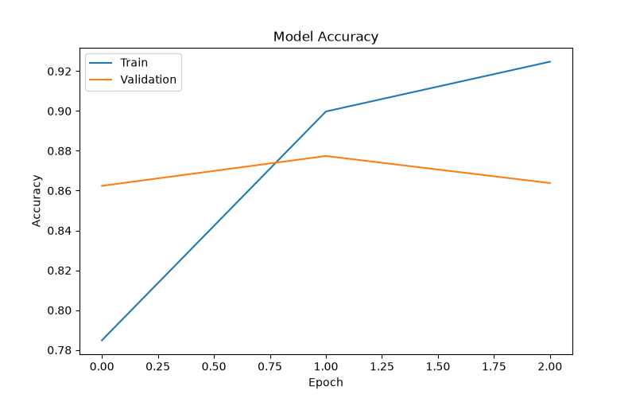
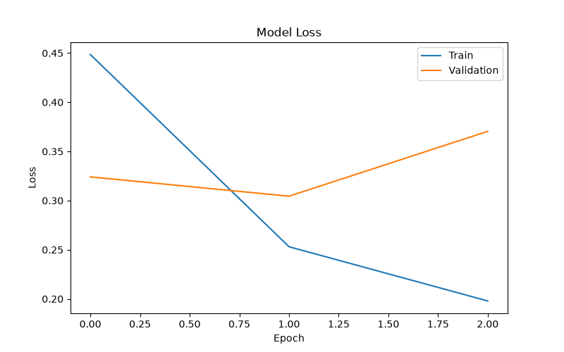

# Sentiment Analysis using Deep Learning

## Project Overview

This project performs sentiment analysis on movie reviews using Natural Language Processing (NLP) and Deep Learning.

The model predicts whether a review is:

* Positive 😊
* Negative 😞

## Technologies Used

* Python
* TensorFlow / Keras
* NumPy
* Pandas
* Matplotlib
* NLP

## Model Performance

The model was trained on movie review data and achieved good classification accuracy.

### Accuracy Graph

### Loss Graph

## Project Structure

Sentiment_Analysis_Project/

├── main.py

├── predict.py

├── sentiment_model.keras

├── accuracy.png

├── loss.png

├── screenshots/

└── README.md

## How to Run

1. Clone the repository

git clone <repository-url>

2. Create virtual environment

python -m venv venv

3. Activate environment

venv\Scripts\activate

4. Install dependencies

pip install tensorflow numpy pandas matplotlib

5. Run prediction

python predict.py

## Sample Output

Enter Review: This movie was amazing and I loved it

Prediction Score: 0.9657

Positive Review 😊

## Author

Sanjay S

